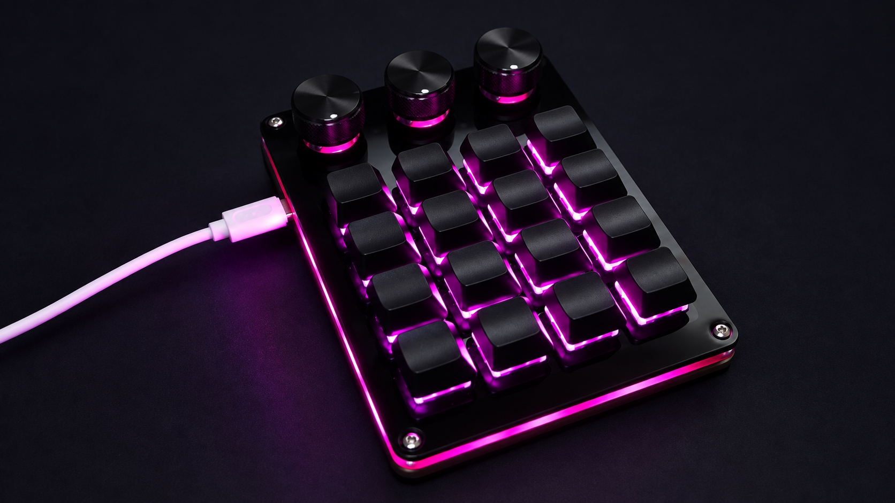
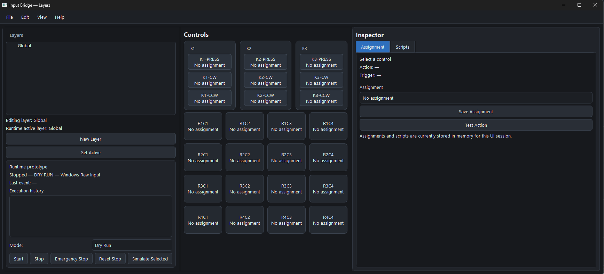

# Input Bridge

**Documentation:** [Read the online documentation](https://buffipulsa.github.io/input-bridge/)

> **Development status:** Input Bridge is an active work-in-progress. APIs,
> profile formats, UI behavior, and hardware support may change without notice.

Input Bridge is host-side software for a programmable USB macropad with 16
mechanical keys and three rotary encoders.

The project separates physical input from host actions. The macropad emits
stable HID events, while Input Bridge resolves those events through layered
profiles and can run actions such as Python scripts or Windows commands.

## Hardware

Input Bridge was developed with the following 16-key macropad with three
rotary encoders:



The photo shows the hardware used for development; similar-looking macropads
may use different USB interfaces or protocols.

The initial hardware target is the tested device identified by:

```text
Vendor ID: 0x0816
Product ID: 0x2475
Manufacturer: SDINNOVATION
Interfaces: standard keyboard/consumer collections and a vendor-defined HID collection
```

Similar-looking macropads must not be assumed to use the same protocol.

## Current status

Working:

- Read-only HID discovery and descriptor inspection.
- Windows Raw Input observation without opening HID write handles.
- Normalization of the 4×4 grid and three encoder actions into stable IDs such
  as `R1C1`, `K1-CW`, and `K3-PRESS`.
- Layer and sublayer editing in a PySide6 UI.
- Layer-aware profile resolution with Global fallback behavior.
- Host-side layer navigation using `K1-CW`, `K1-CCW`, and `K2-PRESS` when
  those controls are not assigned in a profile.
- Python script definitions stored in profiles and executed only through an
  explicit execution path.
- Dry Run and Execute Actions runtime modes.
- Background action execution, emergency stop, and in-memory execution
  history.
- Profile persistence in the user's local application-data directory.

Not yet implemented or confirmed:

- Automatic foreground-application detection.
- Maya-side integration or a Maya bridge.
- Linux input support.
- Host control of the device's RGB lighting.
- A complete, independently verified configuration protocol.
- A public release package or GitHub-hosted issue tracker.

## Documentation

The API reference and public hardware notes are built from the Sphinx sources
under `docs/` and published on GitHub Pages:

[https://buffipulsa.github.io/input-bridge/](https://buffipulsa.github.io/input-bridge/)

The site is rebuilt automatically when documentation or related source files
change on `main`.

## Current UI

The current PySide6 editor provides a visual layer editor, physical-control
layout, assignment inspector, script editor, runtime controls, and execution
history.



## Safety boundary

Input Bridge can eventually turn a hardware event into arbitrary local code
execution. Treat profiles, imported configuration, and Python scripts as
executable content.

The default runtime mode is **Dry Run**. Execute Actions requires an explicit
confirmation in the UI. Scripts run in a child Python process without shell
interpolation, and the application does not require administrator privileges.

Device inspection is read-only by default. Do not run the experimental
`write_*.py` tools unless the target interface, report format, and recovery
plan have been reviewed first. The project does not install vendor software,
custom drivers, or firmware.

See [SECURITY.md](SECURITY.md) for the project security policy and
[docs/protocol-951.md](docs/protocol-951.md) for hardware observations.

## Requirements

- Windows 11 for the current Raw Input integration.
- Python 3.14.
- [UV](https://docs.astral.sh/uv/).
- The tested macropad connected over USB for hardware observation.

## Setup with UV

From the repository directory:

```powershell
uv sync
```

If UV's cache location is not writable on your machine:

```powershell
$env:UV_CACHE_DIR = ".uv-cache"
uv sync
```

## Run the tools

Enumerate the target HID device:

```powershell
uv run inspect-macropad
```

Observe and catalog Raw Input events:

```powershell
uv run observe-raw-input "manual-test" --seconds 5
```

The standalone observer is dry-run by default. Profile-backed execution is
explicitly opt-in:

```powershell
uv run observe-raw-input "profile-test" `
  --seconds 5 `
  --profile "$env:LOCALAPPDATA\Input Bridge\profiles\example.json" `
  --execute-actions
```

Start the graphical layer editor:

```powershell
uv run layer-editor
```

The editor supports creating layers, entering sublayers, assigning scripts,
selecting the runtime active layer, testing actions, and saving profiles.

## Profiles and scripts

Profiles contain layer definitions, bindings, and Python source text. The UI
saves profiles under:

```text
%LOCALAPPDATA%\Input Bridge\profiles
```

Bindings are resolved from the most specific active layer outward to Global.
For example, a `Maya/Modeling` binding overrides a `Maya` binding, which
overrides a Global binding for the same control and trigger.

The project intentionally keeps action execution separate from the device.
The device is used as an input source; scripts and host actions remain in the
profile and run on the computer.

## Development

Run the test suite and checks with:

```powershell
uv run python -m unittest discover -s tests -v
uv run ruff check src tests
uv run python -m compileall -q src tests
```

The source package lives under `src/input_bridge`. The main boundaries are:

```text
src/input_bridge/
  domain/          device-neutral models and event normalization
  application/    profiles, layers, actions, and runtime coordination
  infrastructure/ Windows HID/Raw Input and local storage adapters
  ui/              PySide6 editor and visual theme
tests/             behavior and contract tests
docs/              public protocol and development documentation
```

## Project scope

This is an independent interoperability project based on observations of one
physical device. It does not include vendor binaries, copied web assets,
firmware dumps, or proprietary software.

## License

This project is released under the MIT License. See [LICENSE](LICENSE).
